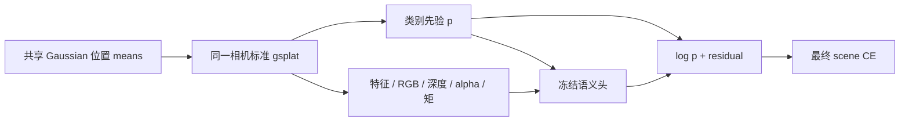

# 冻结语义读出的完整几何梯度：真实接线检查

2026-09-27。独立标准 gsplat adapter 已在固定 TRAIN 002/041 上完成检查。**新旧 RGB、最终语义概率、features、depth、alpha 和深度矩前向完全相同；仅 raw 有约1e−35级尾数差，两图三个损失及 raw／final argmax 均相同。** 六个实际 means VJP 均有限且非零，单步候选降低两图的 scene CE。结果仅说明本接线可产生实际候选，不是留出提升或旧梯度数值门通过。

旧 `render_direct_q` 的上下文在 no_grad 内，custom shader不支持means梯度。新 `direct_q_geometry_render` 用标准 gsplat 显式合成固定 q、features 与 live z/z²/zf；`geometry_grad=True` 让 refiner 的RGB／深度／覆盖率及矩统计对means求导。所有其他参数冻结，没有straight-through替换。现有head和moment函数默认仍采用旧detach行为，checkpoint结构不变。

| 固定 TRAIN | scene CE 起点 | 单步候选 | 实际 scene CE 差 | 实际 RGB MSE 差 | 实际 raw CE 差 |
|---|---:|---:|---:|---:|---:|
| 002 | .003333855094 | .003274979245 | −5.887584884e−5 | −2.089165860e−9 | −8.022189733e−6 |
| 041 | .004404412395 | .004325773067 | −7.863932828e−5 | +1.276554645e−7 | +5.311760223e−6 |

候选各从原始means、fresh Adam起步，仅scene CE方向；原学习率与每点每步1/64 Mahalanobis cap不变。两次都随后完整回滚，0训练提交。041的RGB和raw CE上升，不能把scene目标下降当所有目标共同改善。保存scene梯度与实际位移内积分别−5.884789335e−5／−7.765483954e−5；这不是全局VJP精度证书。

2旧direct-q、4新adapter、6head、12标准gsplat高层调用、18低层通道raster、2custom shader、6means VJP、6目标解码。内部4.316399s／外4.821223s，自然退出0；峰值allocated6,867,216,384 bytes。0teacher／VAL／生产模型覆盖，场与数值状态恢复。

54项CPU合同和Ruff通过，测试源码SHA与84份冻结source中对应文件一致，未重复相同测试。独立CPU审计1.589s／外1.719s自然0，从两份NPZ复算三损失、6个g·实际位移、RGB／raw／scene前向差及argmax、实际非零更新数，36标量最大差2.78e−17。没有重新执行VJP或读取原GT；未保存的features／depth／moments数组、Adam及协方差只依据执行记录，不能称独立再生成。

运行：`/mnt/data/SHM2026/runs/readout_geometry_probe_v1`。

| 记录 | SHA256 |
|---|---|
| plan | `499e7b76cab849dc9515438c853fd12d9d4e3aa24456211c06778480b0051f7e` |
| worker | `7fef6328990cf54e4b33056404e11afcc75e06a8a185b80ec80ed1775811e64b` |
| execution | `bd8a14883622e195a06d5aa47d5e53ea5af4f04c7154def4b0b8223ddc6dfd8c` |
| independent audit | `c254d714aa5a009e90469d7c1127f71332866b5151c38c6bac04a2aac19b4abb` |

下一固定对照分别使用完整scene梯度和prior-only路径梯度，保持前向、样本、优化器及计算预算一致。prior包括外部log-prior、头内p3d和entropy；context包括features、RGB、depth、alpha与全部moments。现有 `geometry_grad=False` 仍保留feature路径，不能误作prior-only。普通停止梯度和完整scene CE均有先例，本检查本身没有建立学术创新。

两组前向都完整使用图中的所有输入。完整组沿全部路径反传；prior-only组只在语义头接收上下文E时截断反向梯度，p进入头内及外部log的两条路径都保留。RGB损失单独沿自身渲染路径求导，两组相同。该图解释实际计算图，不表示任何路径已被证明更优；先例边界见[研究说明](readout_geometry_prior_art.md)。
